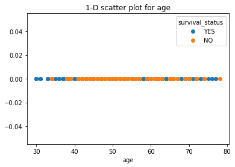
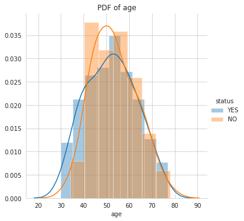

# Post-Surgical-Survival-of-Cancer-Patients
### To classify the persons who are survived after the surgery and who are dead after the surgery.

**Author** : SHAILESH DHAMA

Description: The data set contains cases from a study that was conducted between 1958 and 1970 at the University of Chicago's Billings Hospital on the survival of patients who had undergone surgery for breast cancer.

Objective: Our objective is to classify/predict a patient's survival who had undergone surgery for breast cancer.

### Dataset :

The dataset contains cases from a study that was conducted between 1958 and 1970 at the University of Chicago's Billings Hospital on the survival of patients who had undergone surgery for breast cancer.

#### Dataset Attributes:

*age: Age of patient at time of operation (numerical)

*year: Patient's year of operation (year - 1900, numerical)

*nodes: Number of positive axillary nodes detected (numerical)

*status: Survival status (class attribute)

*1= the patient survived 5 years or longer

*2= the patient dies within 5 years

## Approach:

### Data processing & Exploratory Data Analysis:

    1.Importing packages and libraries
    2.Loading Dataset
    3.Univariant Analysis
    4.Modelling
    5.Model Evaluation With Power Transform
    
## RESULTS :

#### 1-D scatter plot for age


#### 2-D Scatter Plot


#### Pair Plots


#### PDF(Probability Density Function) for age


#### PDF(Probability Density Function) for year


#### PDF(Probability Density Function) for nodes


#### PDF and CDF for positive_lymph_node


#### Box Plots


#### Violin Plots


#### Contour Plot


#### Model Prediction


### For further information:

Please review the narrative of our analysis in [our jupyter notebook](./Survival%20of%20Haberman's%20Cancer%20Patients%20after%20surgery.ipynb)

For any additional questions, please contact **shaileshettyd@gmail.com)

##### Repository Structure:

```
├── README.md                                                                                                   <- The top-level README for reviewers
├── Survival%20of%20Haberman's%20Cancer%20Patients%20after%20surgery.ipynb                                      <- Narrative documentation of analysis
├── haberman.csv                                                                                                <- Dataset
└── images                                                                                                      <- generated from code
```
## Citing :

```
@misc{Shailesh:2021,
  Author = {Shailesh Dhama},
  Title = {Post-Surgical-Survival-of-Cancer-Patients},
  Year = {2021},
  Publisher = {GitHub},
  Journal = {GitHub repository},
  Howpublished = {\url{https://github.com/ShaileshDhama/Post-Surgical-Survival-of-Cancer-Patients}}
}
```
